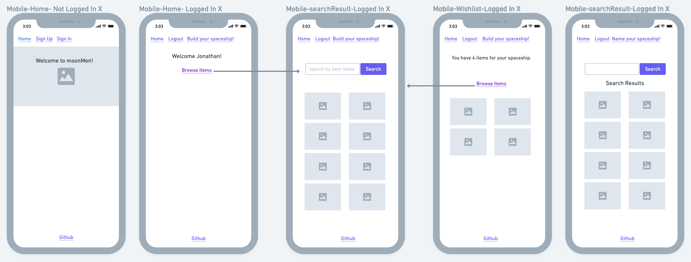

# 👾 moonMan 🌖

[moonMan](http://moonman.surge.sh/ "moonMan, never forget to wonder") is a fully functional CRUD app with authentication and authorization. It was designed by our team as part of the Mandalorians winter 2020 Software Engineering Immersive cohort at General Assembly.

## moonMan is a web app for people who feel more at home looking up into the stars than they do lounging in their Earthly homes.

With the newly redesigned moonMan app, use the interactive and intuitive interface to easily browse through a collection of new and used space ship parts that, when all put together, will allow you to travel the expanse of virtual space.

#### Don’t see the parts you need?

- Search, add, edit, and delete parts as needed.
- Add favorite parts to your wishlist and off you go! Whether you are trying to find the planet on which you were probably born, or if you're just visiting.
- Includes authentication and authorization.

## moonMan team:

- Mary Mac Murray,
- Ro Cosenza,
- Jonathan Hernandez,
- Rico DeRosa

## Colors


## Wireframes

#### Mobile



#### Desktop


## 👩🏽‍🚀 Feature List

Features of moonMan include:

- Browsing space items
- Searching space items
- Adding space items to wishlist
- CRUD operations

### 🚀 MVP

#### Bug Fixes

- Stay loggedin if page is refreshed.
- Fix creating a new item (you have to refresh page/log out and back in to see the new item)
- Fix editing an item (you have to refresh page/log out and back in to see the edits)
- Updating design to be mobile-centric (responsive)

#### Current working features

- User Auth(Sign in/Sign up/Auth view)
- Item display
- Update an item on backend (shows in db)
- Create an item on backend (shows in db)

#### New Features

- Wishlist functionality-
  - User creates a wishlist
  - User adds items to wishlist
  - User deletes items from wishlist
  - Homepage shows wishlist
- Search functionality
  - Includes a search bar

### 🌟 Post-MVP:

- React-Bootstrap Material UI

  - Animation effects for certain clicks
  - Interacting 404 page as well as a loading icon/page

- Screen for Meteor and Asteroid alerts (asteroid alert api required).
- Facts section of UFO sightings with suggested items to purchase to prepare.
- Marketplace to hire fellow space-goers and friendly aliens as travel companions/navigators/general crew members.
- Add images to each item
- Sound effects

### 🗒️ Component Hierarchy:

```
Container
  |__ Wishlist
  |__ Browse items
     |__ Search
```

### 📦 Dependencies:

FrontEnd:

- react/react router
- react styled themes
- axios
- cors
- bcrypt
- Body-Parser
- Particles.js from https://vincentgarreau.com/particles.js/

Backend:

- Faker (we still using this?)
- MongoDB/Mongoose
- Express
- Morgan

Testing:

- Jest
